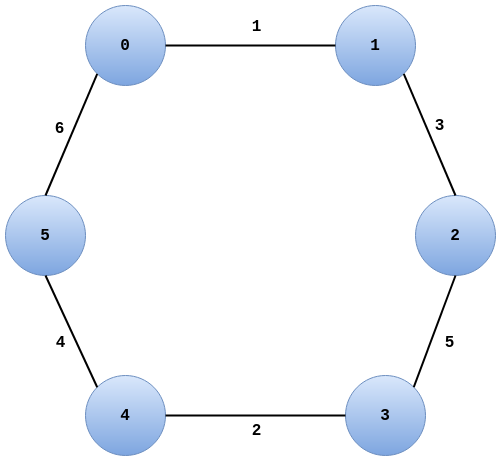

# Minimum Weighted Spanning Tree of asynchronous weighted networks of Gallager, Humblet, and Spira

Exercise 3B for Distributed Algorithms (IN4150), implementing the algorithm for creating minimum weight spanning trees
in an asynchronous network.

To build the .jar file, execute from the current directory,

```bash
mvn clean package
```

The build will generate a .jar files in the target/ directory. To execute the generated .jar file run this for one 
JVM instance,

```bash
java -Djava.security.policy=java.policy -jar target/DAGallagerHumbleSpira.jar -proc=6
```

There are additional parameters for specifying the port to bind to and the IP address on which to do rmi.
All possible parameters are passed last in the command line, after specifying the .jar to execute. The parameters 
are `-proc=` for specyfing the number of local processes (default 1) to create in this JVM instance (Note each process 
still has its own thread runnning), `-port=` to specify the port to bind processes to and, if specified, initialize the 
rmi on (default 1098), `-ip=` to specify the ip to bind processes to the rmi (default localhost), and lastly `-conf=` 
to specify the config file for the network to construct. **NOTE** The program can be run truly distributed, but all
machines need to have the same config file and need to be compiled with it in the resource directory.
The default network config, which is used if no config file is provided, contains a small network of 6 processes with
a final core of name 5 and level 2, which can be run on two separete machines or JVMs with each one passing the `-proc=3`.  
**IMPORTANT** The total number of processes needs to be the same as the number of processes specified in the config file,
but the processes can be split over different JVMs/machines however desired as long as they all add up to the total 
number required.

## Network Config

The network is configured, by providing a list of the connected nodes and the weight the edge has with the following
syntax,

```bash
rmi:://[ip]/process-[id] [weight] rmi:://[ip]/process-[id]
```

where `ip` is the ip that the RMI registry is on (so the one also provided in the cmd line when running the program,
or localhost), and `weight` is the weight of the edge. Have a look at the [default.conf](https://github.com/nicktehrany/Distributed-Algorithms/blob/ex3/exercise-3b/src/main/resources/default.cfg) file. Additionaly, we proive three different networks that we have tested for the final
report. The number of processes speciefied in the network config can distributed over different machines however desired,
but the total number of processes over all machines has to be equal to the number of processes in the network config.
**NOTE** When adding your own network configs, the code needs to be recompiled, as the config is used as a
resource, and weights need to be unique for achieving determinism with this algoirithm. This is done as follows 
(if your network is called mynetwork.cfg)


```bash
mvn clean package
java -Djava.security.policy=java.policy -jar target/DAGallagerHumbleSpira.jar -proc=1 -conf=mynetwork.cfg
```
## Program

The program will create however many processes specified per JVM, with each process having its own thread, assign
the edges of a process to that process (self edges are ignored), and wait for 10 secomds
for other remote processes to bind to the registry (**NOTE** if a porcess not specified in the network config id not 
created within the first 10 seconds, it will be missing in the network, possibly making it two unconnected networks,
which will cause RemoteException), so it's important to start the correct number of processes in time. From there, in each
JVM a random local process (to that JVM) will initate the algorithm, and all intermediate message exchanges and 
merges or abosrbs, as well as the final core and level will be documented. The program adds random delays before 
processes start handling received messages and execute work.

When a process does not find a new MOE candidate, the algorithm is finished, at which point it will broadcast a
finished message to all registered processes. This message is not part of the algorithm but only meant to cleanup all
threads and have each machine/JVM log the final MST result once, after which the program terminates.

## Networks

1. The default network ([default.cfg](https://github.com/nicktehrany/Distributed-Algorithms/blob/ex3/exercise-3b/src/main/resources/default.cfg))
has 6 nodes in total, and a final MST core edge with edge weight 5 and a final level 2 (2 merges and 2 absorbs) 
without edge with weight 6.  


2. 